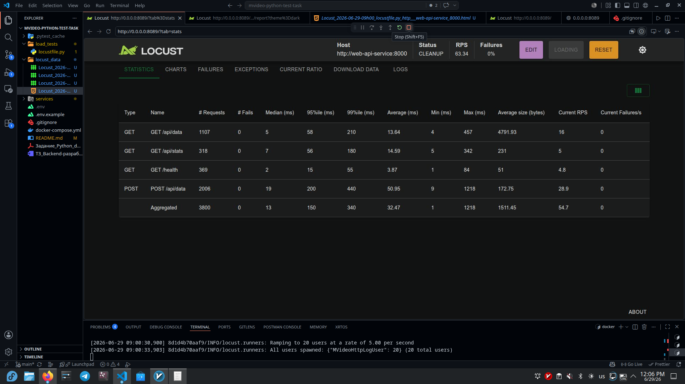
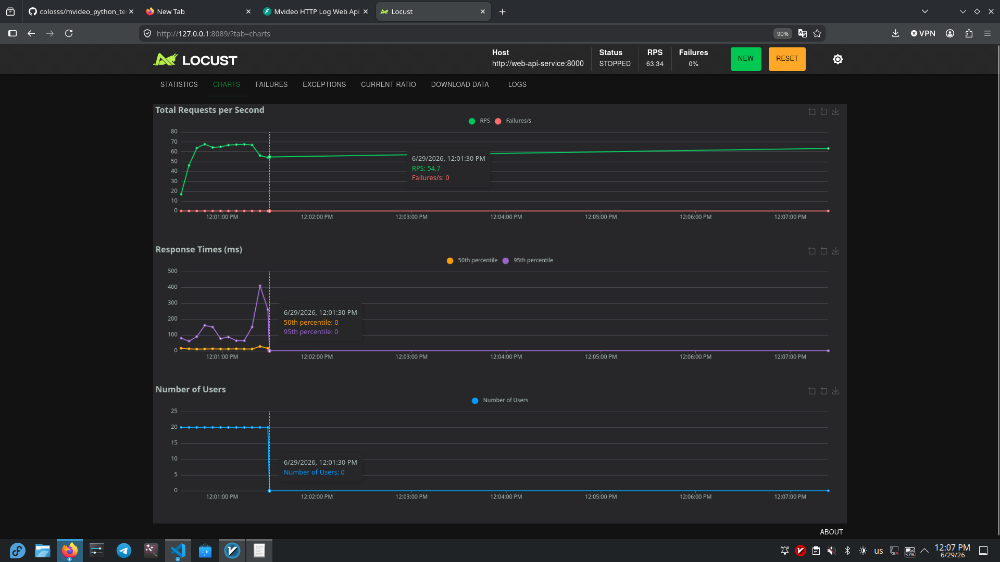

# MVideo Python test task

Это тестовое задание на Python.

Проект принимает HTTP логи, сохраняет их в PostgreSQL, позволяет получать сохраненные данные через API и отдельно выгружает их в файл через фоновый сервис.

Формат одного лога:

```text
192.168.1.1 GET /api/users 200
```

В проекте есть 3 основных сервиса:

- web-api-service - принимает логи, проверяет их и сохраняет в PostgreSQL
- client-service - генерирует случайные логи и отправляет их в web-api-service
- background-processing-service - периодически забирает логи из web-api-service и сохраняет их в файл

Дополнительно добавлен load-test сервис для проверки нагрузки через Locust.

## Стек

- Python 3.11
- FastAPI
- Pydantic
- SQLAlchemy
- asyncpg
- PostgreSQL
- Alembic
- httpx
- Docker
- Docker Compose
- Locust

## Архитектура

Проект разделен на несколько сервисов, потому что по заданию клиент, Web API и фоновая обработка должны быть отдельными частями системы.

Внутри сервисов код разделен по слоям:

- core - основные модели и интерфейсы
- application - основная логика приложения
- infrastructure - работа с базой, файлами и HTTP клиентами
- interfaces - API, worker и точки запуска
- config - настройки из переменных окружения

Такое разделение нужно, чтобы основная логика приложения не зависела напрямую от FastAPI, SQLAlchemy, файловой системы или конкретного HTTP клиента.

## Что делает web-api-service

web-api-service принимает HTTP лог через POST /api/data.

Пример тела запроса:

```json
{
  "log": "192.168.1.1 GET /api/users 200"
}
```

Сервис делает следующее:

- проверяет формат строки
- разбирает строку на ip, method, uri и status_code
- создает уникальный id записи
- сохраняет время создания записи
- сохраняет запись в PostgreSQL
- возвращает сохраненные записи через GET /api/data
- считает статистику через GET /api/stats

Для работы с базой используется SQLAlchemy async и asyncpg.

## Что делает client-service

client-service генерирует случайные HTTP логи и отправляет их в web-api-service.

Он умеет:

- работать в несколько потоков
- делать случайную задержку между запросами
- брать количество потоков и задержку из переменных окружения
- логировать все отправленные сообщения в файл

Файл с отправленными логами внутри контейнера:

```text
/var/log/client-service/sent_logs.jsonl
```

## Что делает background-processing-service

background-processing-service периодически делает GET запросы к web-api-service и сохраняет полученные записи в файл.

Файл с выгруженными логами внутри контейнера:

```text
/data/http_logs.jsonl
```

Сервис хранит состояние выгрузки в отдельном файле:

```text
/data/http_logs.state.json
```

Чтобы несколько экземпляров background-processing-service не писали в один файл одновременно, используется файловая блокировка через fcntl.flock.

## Запуск проекта

Сначала нужно создать .env файл:

```bash
cp .env.example .env
```

Запустить все сервисы:

```bash
docker compose up --build
```

После запуска Web API будет доступен здесь:

```text
http://localhost:8000
```

Swagger документация:

```text
http://localhost:8000/docs
```

Остановить проект:

```bash
docker compose down
```

Остановить проект и удалить данные из volume:

```bash
docker compose down -v
```

## API

Создать лог:

```bash
curl -X POST http://localhost:8000/api/data \
  -H "Content-Type: application/json" \
  -d '{"log":"192.168.1.1 GET /api/users 200"}'
```

Пример успешного ответа:

```json
{
  "id": "uuid",
  "created": "2025-01-01T12:00:00",
  "log": {
    "ip": "192.168.1.1",
    "method": "GET",
    "uri": "/api/users",
    "status_code": 200
  }
}
```

Получить сохраненные логи:

```bash
curl "http://localhost:8000/api/data?limit=10&order=desc"
```

Получить логи с фильтром по методу:

```bash
curl "http://localhost:8000/api/data?method=GET&limit=10"
```

Получить логи с фильтром по статусу:

```bash
curl "http://localhost:8000/api/data?status_code=200&limit=10"
```

Получить статистику:

```bash
curl http://localhost:8000/api/stats
```

Пример ответа статистики:

```json
{
  "methods": {
    "GET": 120,
    "POST": 95,
    "PUT": 12
  },
  "status_codes": {
    "200": 210,
    "404": 15,
    "500": 2
  }
}
```

Статистика считается на стороне базы через SQL запросы с группировкой.

## Параметры GET /api/data

- limit - сколько записей вернуть
- offset - сколько записей пропустить
- method - фильтр по HTTP методу
- status_code - фильтр по HTTP статусу
- created_after - получить записи после указанного времени
- created_before - получить записи до указанного времени
- order - сортировка, asc или desc

## Переменные окружения

PostgreSQL и Web API:

- DB_NAME - имя базы данных
- DB_USER - пользователь базы данных
- DB_PASSWORD - пароль базы данных
- DB_PUBLIC_PORT - порт PostgreSQL на компьютере
- DB_ECHO - включить или выключить вывод SQL запросов
- WEB_API_PUBLIC_PORT - порт Web API на компьютере

Client service:

- CLIENT_WORKERS - количество потоков клиента
- CLIENT_MAX_DELAY_MS - максимальная задержка между запросами в миллисекундах
- CLIENT_REQUESTS_PER_WORKER - количество запросов на один поток, 0 значит без ограничения
- CLIENT_HTTP_TIMEOUT_SECONDS - timeout для HTTP запроса

Background service:

- FETCH_INTERVAL_SECONDS - как часто забирать данные из Web API
- EXPORT_BATCH_LIMIT - сколько записей забирать за один запрос
- BACKGROUND_HTTP_TIMEOUT_SECONDS - timeout для HTTP запроса

Load test:

- LOCUST_USERS - количество виртуальных пользователей
- LOCUST_SPAWN_RATE - скорость запуска пользователей
- LOCUST_RUN_TIME - время выполнения теста
- LOCUST_MAX_FAIL_RATIO - максимальный допустимый процент ошибок
- LOCUST_MAX_P95_MS - максимальный допустимый p95 в миллисекундах

## Миграции

Таблица для логов создается через Alembic при старте web-api-service.

При обычном запуске через Docker Compose ничего отдельно запускать не нужно.

## Load test через Locust

Для проверки нагрузки добавлен отдельный сервис load-test.

Запуск:

```bash
docker compose --profile load-test up --build load-test
```

Locust запускается в headless режиме, то есть без веб интерфейса. Он сам отправляет запросы в web-api-service и выводит итоговую статистику в консоль.

В тесте проверяются основные endpoint'ы:

- POST /api/data
- GET /api/data
- GET /api/stats
- GET /health

Текущий тест запускался с такими параметрами:

- пользователей: 20
- скорость запуска пользователей: 5 пользователей в секунду
- время теста: 1 минута
- всего запросов: 3855
- ошибок: 0
- общий fail ratio: 0.0000
- общий p95: 87 ms
- среднее время ответа по всем запросам: 23 ms
- средняя скорость: 65.79 запросов в секунду

Итоговый результат:

```text
Aggregated:
requests: 3855
fails: 0
fail ratio: 0.0000
avg response time: 23 ms
p95: 87 ms
rps: 65.79
```

Результаты по endpoint'ам:

```text
GET /api/data:
requests: 1049
fails: 0
avg: 9 ms
p95: 13 ms

GET /api/stats:
requests: 352
fails: 0
avg: 9 ms
p95: 13 ms

GET /health:
requests: 382
fails: 0
avg: 2 ms
p95: 8 ms

POST /api/data:
requests: 2072
fails: 0
avg: 35 ms
p95: 130 ms
```

По результатам теста сервис отработал без ошибок. Самым тяжелым endpoint'ом ожидаемо оказался POST /api/data, потому что он парсит лог и пишет данные в PostgreSQL. GET запросы работают быстрее, а статистика считается через агрегирующие SQL запросы.

В репозитории также сохранены скриншоты Locust:

- locust statistics
- locust charts

Они нужны, чтобы результат нагрузки можно было посмотреть не только по выводу в консоль, но и визуально.

## Решения и допущения

- все сервисы запускаются через docker compose
- настройки вынесены в переменные окружения
- Web API сделан асинхронным на FastAPI
- PostgreSQL используется как основное хранилище логов
- каждая запись получает uuid и created timestamp
- лог должен состоять из ip, method, uri и status_code
- uri должен начинаться с /
- status_code должен быть в диапазоне от 100 до 599
- GET /api/data поддерживает пагинацию, сортировку и фильтры
- GET /api/stats сделан как дополнительное задание
- статистика считается через SQL GROUP BY, а не в Python
- background-processing-service хранит состояние последней выгрузки
- общий файл выгрузки защищен файловой блокировкой
- client-service пишет все отправленные сообщения в jsonl файл
- load-test добавлен отдельно и не мешает обычному запуску проекта

## Структура проекта

```text
.
├── docker-compose.yml
├── .env.example
├── README.md
├── load_tests
├── locust_data
└── services
    ├── web_api_service
    ├── client_service
    └── background_processing_service
```

## Пример Locust-statistics



## Пример Locust_charts

